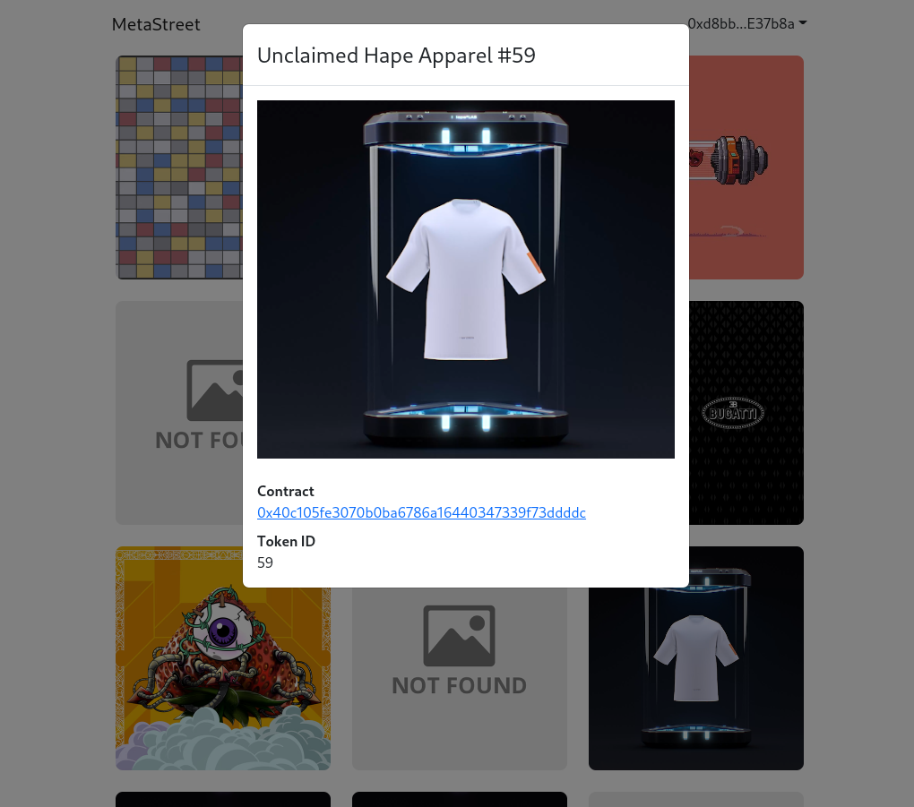

# MetaStreet



### Running the app
  ```bash
    npm ci
    npm run start
    # visit localhost:3000
  ```

### Note
  If `address` query parameter is provided then that is used to receive nft assets (not wallet address that is active). This is for testing purposes.

  Example - http://localhost:3000/address=0xc66D38f01E5BdEA8a8926A1661A19D05E98e6455 

### Things to improve
* Don't use bootstrap
* Add tests
* Use paging for tokens
* Validate incoming data (don't trust external APIs)
* Handle errors
* Proper data "loading" view
* Add "transfer NFT" feature